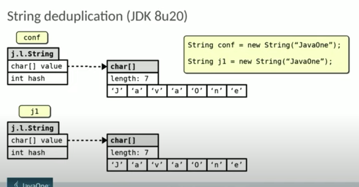

# Java 8


I.  HashTable

* 8번정도 충돌 나면, LinkedList를 Tree\(red-black\) 형태로 바꾼다.
* 6개가 되면 다시 LinkedList로 변경한다.
  * 7개가 아닌 이유는 성능저하를 막기 위해서
* 충동 개선 방식
  * Open Addressing
    * 연속된 공간에 넣기 때문에 캐시 효율이 높다.
    * 배열의 크기가 커질 수록 캐시효율이 낮아진다.
  * Separate Chaining
    * Linked List, tree 방식
    * HashMap은 해당 방식 사용.

II. 람다 지원

* 익명함수를
* 기존에는 new interface\(\) override하는 방식을 \(\) -&gt; {} 이런식으로 표현 가능
* 일급객체라서 변수에 저장 가능.
* 가독성

III. interface

* 1.8부터는 인터페이스 안에 메소드를 구현할 수 있다.
* default
  * 메소드 구현 가능
  * 재정의 할 수 있다.
* static
  * 메소드 구현
  * 재정의 불가
  * interface명으로 호출해야함. 

```java
interface Hello {
    public static void world(){
        System.out.println('hahaha');
    }
}
Hello.world();
```

IV. 스트림 API

* iterator 반복자를 매번 코드를 작성하는 불편함 제거


---

JVM 


### I. String Dedeplication



* String Dedeplication 추가 \(G1 GC에서만\)
  * chars를 공유한다. string은 계속 새로 생성.
  * char\[\] value는 외부에서 접근하지 못한다. private final
  * [https://stackoverflow.com/questions/32854968/java-8-string-deduplication-vs-string-intern](https://stackoverflow.com/questions/32854968/java-8-string-deduplication-vs-string-intern) 
  * [https://openjdk.java.net/jeps/192](https://openjdk.java.net/jeps/192)
  * 단점\(trade-off\)
    * 약간 CPU를 더 사용 한다.
    * young collectiion을 더 발생 시킨다.


### II. Class unloading with concurrent mark

* 
