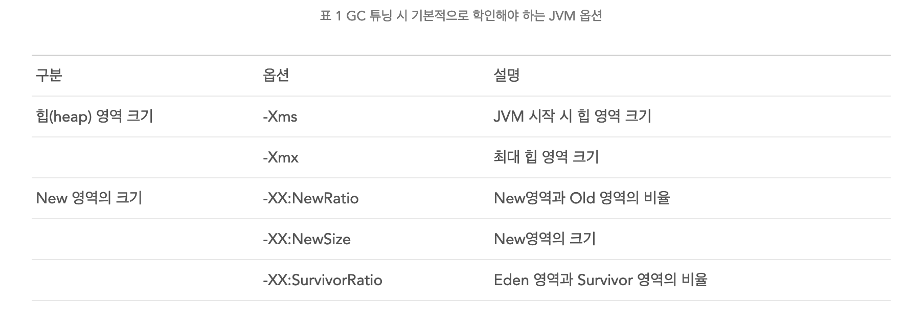

# JVM 셋팅

객체의 크기가 Servivor 영역보다 클 경우, 바로 Old 영역으로 간다. 그러므로, 객체의 크기가 작을수록 좋다.

* [https://deveric.tistory.com/64](https://deveric.tistory.com/64)

GC가 어떤 것이든 Young Generation 영역의 Minor GC에서 **STW\(Stop the world\)**가 발생한다.

* [https://okky.kr/article/379036](https://okky.kr/article/379036)

* threshhold 을 수정 함으로써, Old 영역에 가는 비율을 줄일 수 있다.

